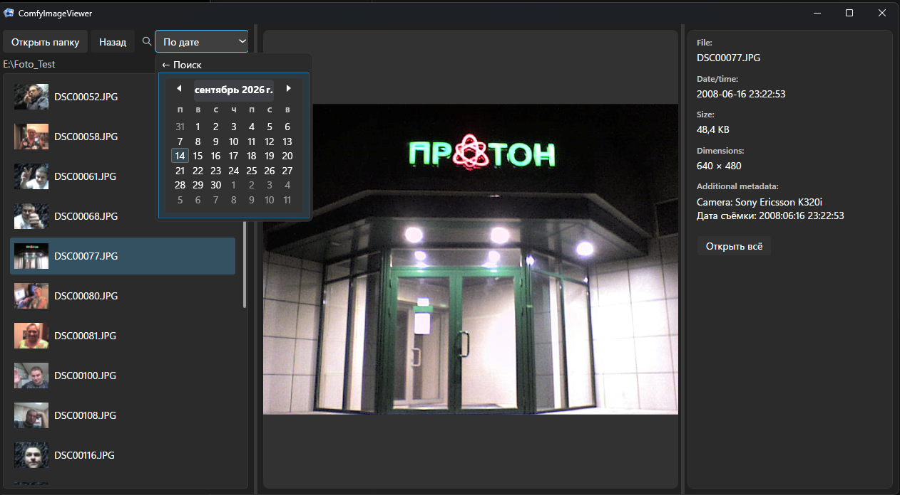

# ComfyImageViewer

Portable image viewer for ComfyUI-generated images with model, date, EXIF and GPS metadata search.

ComfyImageViewer is a Windows desktop app for browsing folders of images. It handles two kinds
of content at once: ordinary photos (JPEG/WebP with EXIF) and ComfyUI-generated images (PNG with
embedded workflow metadata), showing the right information panel for each type.

## Features

- **ComfyUI metadata** — reads workflow metadata embedded in PNG files: model names and prompt
  text, shown in the details panel.
- **Search by model** — drill-down through model families defined in an external, editable
  `ModelFamilies.json` (kept next to the executable) to find images generated by a specific model.
- **Search by date** — calendar-based search (day or range) across a folder tree. Photo dates use
  EXIF `DateTimeOriginal` when present and fall back to the file creation date otherwise.
- **EXIF metadata** — camera, software and capture date for JPEG/WebP images.
- **GPS location** — capture coordinates extracted from EXIF GPS data, shown as decimal
  `Latitude, Longitude` when valid coordinates exist (empty/stripped GPS IFDs are ignored).
- **Fully local** — no network access, no external APIs, no geocoding. Metadata is read from
  your files and displayed as is.

## Screenshots

| Date search / EXIF | ComfyUI metadata / model and prompt |
|---|---|
|  |  |

## Portable (no installation)

ComfyImageViewer is distributed as a self-contained, single-file Windows build:

1. Download the portable ZIP from the **Releases** page of this repository.
2. Extract it to any folder.
3. Run `ComfyImageViewer.exe`.

The ZIP contains just `ComfyImageViewer.exe` and `ModelFamilies.json` (an editable model-family
config). No .NET installation is required — the runtime is embedded into the executable.
Your data never leaves your machine.

## Building from source

Requires the .NET 10 SDK on Windows (WPF workload):

```
dotnet build ComfyImageViewer.slnx -c Release
```

## Repository layout

- `src/ComfyImageViewer.App` — WPF application (UI, view models).
- `src/ComfyImageViewer.Core` — platform logic: folder scanning, thumbnail cache, ComfyUI PNG
  metadata parsing, EXIF/TIFF reader (dates, GPS), search services.
- `tests/ComfyImageViewer.Core.Tests` — unit tests for the core layer.
